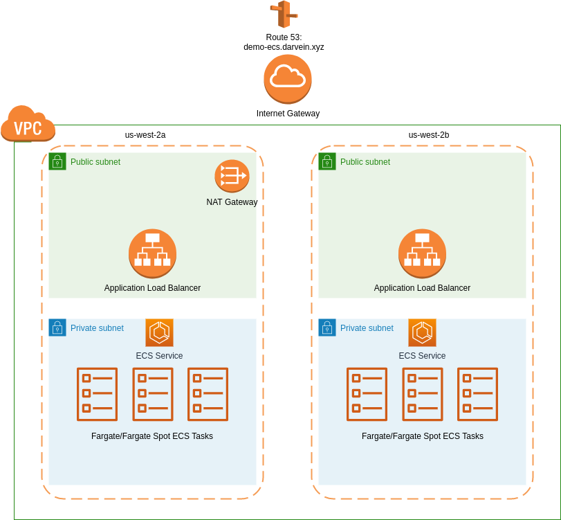

ECS Demo
===

Infrastructure:
- VPC + Nat Gateway
- Application Load Balancer
- ECS Cluster + Fargate + service autoscaling
- Example Nginx application

The project is structured as follows:
- `example-app` that is a simple Nginx application stored in a public ECR repository. The difference from the default image is that it display the hostname in the index.html page
- `terraform/base-infrastructure` Contains all the base infrastructure to run any ECS application: VPC, Subnets, Route Tables, NAT and Internet Gateways, Application Load Balancer, IAM permissions, Security Groups and ECS cluster
- `terraform-example-app-deploy` Contains all the Terraform code that defines the resources required for `example-app` such as task definition, target group, load balancer ingress rules and autoscaling rules.

All the required commands are abstracted in the `Makefile` which has the required targets for the most common Terraform tasks such as plan, apply and destroy.

